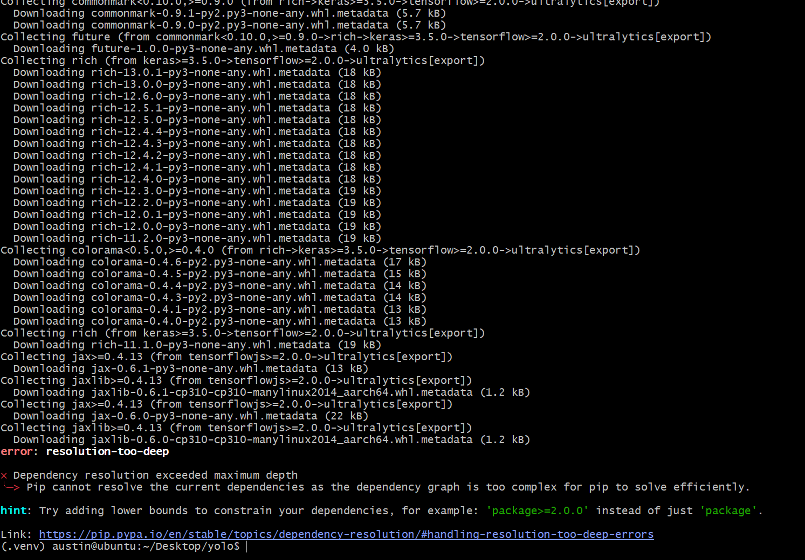

# Getting YOLO11 to Work on the NVIDIA Jetson Orin Nano Super

This guide provides a step-by-step process for setting up YOLO11 (which very confusingly is actually YOLOv8 on the ultralytics website [documentation](https://docs.ultralytics.com/guides/nvidia-jetson/) It's called "YOLO11" not "YOLOv11" and throughout the documentation there are references to "Benchmarked with Ultralytics 8.3.157") on an NVIDIA Jetson Orin Nano Super. This was put together after some trial and error and should serve as a comprehensive walkthrough for a clean installation.

Attempting to follow any documentation I could find always let to a pip "resolution too deep" error.

The board used for this guide is a Jetson Orin Nano with a "Super" firmware update, which enhances performance. However, these instructions should work for any Jetson Orin Nano (though I suppose it definitely requires the latest version of Jetpack 6.x, which would mean it would have the "Super" firmware present).

## Prerequisites

Before you begin, make sure you have the following:

* **Hardware:**
    * NVIDIA Jetson Orin Nano 8gb (Could this work for others? Maybe, but having not tested it, I am making no statement about that)
    * NVMe drive for the OS (could probably use the SD Card, but not having tested that, I definitely can't say for sure)
    * CSI Camera (this guide uses an IMX219-C, specifically the Raspberry Pi Camera Module v2.1 NoIR)
* **Software:**
    * A host PC running Ubuntu 22.04 (you can use Ubuntu 20.04 as well) with the NVIDIA Jetson SDK to flash the Jetson (there are alternative means of flashing the Jetson, the host PC method was the most convienent for me). I will not describe the flashing process here it can be found on the [jetson-ai-lab](https://www.jetson-ai-lab.com/initial_setup_jon_sdkm.html) website.

## Step-by-Step Installation

### 1. Initial Setup and Camera Configuration

First, we'll configure the camera.

1.  Navigate to the Jetson I/O configuration directory:
    ```bash
    cd /opt/nvidia/jetson-io/
    ```
2.  Run the configuration tool:
    ```bash
    sudo python jetson-io.py
    ```
    In the tool's menu, select and set up your camera (e.g., IMX219-C). A reboot will be required to apply the changes (it's part of the python script, sort of like a boot manager, just make sure to select the option to save changes and reboot to apply those changes).

### 2. Verify Camera Functionality

After rebooting, it's a good idea to test that your camera is working correctly.

1.  Create a directory for your project (doesn't need to be here, put the directory whereever you want, just make sure to reflect that change for the rest of the commands):
    ```bash
    mkdir -p ~/Desktop/yolo
    cd ~/Desktop/yolo
    ```
2.  Create the `simple_camera.py` script to test the camera stream. The code is available in the [simple_camera.py](./simple_camera.py) file in this repository.

3.  Run the script:
    ```bash
    python simple_camera.py
    ```
    A window showing the camera feed should appear.

### 3. System Updates and Virtual Environment

Now, let's update the system and set up a virtual environment for our Python packages.

1.  Update your system's package list and upgrade installed packages:
    ```bash
    sudo apt update && sudo apt upgrade -y
    ```
2.  Install `pip` and `venv`:
    ```bash
    sudo apt install python3-pip python3-venv
    ```
3.  Navigate to your project directory and create a virtual environment. The `--system-site-packages` flag is important to ensure access to Jetson-specific packages.
    ```bash
    cd ~/Desktop/yolo
    python3 -m venv .venv --system-site-packages
    ```
4.  Activate the virtual environment:
    ```bash
    source .venv/bin/activate
    ```
    Your terminal prompt should now be prefixed with `(.venv)`.

### 4. Install YOLO11 and Dependencies

With the virtual environment active, we can now install `ultralytics` and its dependencies.

1.  Upgrade `pip`:
    ```bash
    pip install -U pip
    ```
2.  **Handle OpenCV Dependency:** The default `ultralytics` installation includes an `opencv-python` package that can conflict with the system's pre-installed OpenCV on the Jetson. The following steps will install `ultralytics`, remove the conflicting OpenCV package, and then ensure the other dependencies are present.
    ```bash
    pip install ultralytics
    pip uninstall -y opencv-python opencv-python-headless
    pip install --no-deps ultralytics
    pip install matplotlib pandas py-cpuinfo thop seaborn
    ```
3.  Install PyTorch and Torchvision wheels compatible with the Jetson architecture:
    ```bash
    pip install [https://github.com/ultralytics/assets/releases/download/v0.0.0/torch-2.5.0a0+872d972e41.nv24.08-cp310-cp310-linux_aarch64.whl](https://github.com/ultralytics/assets/releases/download/v0.0.0/torch-2.5.0a0+872d972e41.nv24.08-cp310-cp310-linux_aarch64.whl)
    pip install [https://github.com/ultralytics/assets/releases/download/v0.0.0/torchvision-0.20.0a0+afc54f7-cp310-cp310-linux_aarch64.whl](https://github.com/ultralytics/assets/releases/download/v0.0.0/torchvision-0.20.0a0+afc54f7-cp310-cp310-linux_aarch64.whl)
    ```
4.  Install the CUDA keyring and related libraries:
    ```bash
    wget [https://developer.download.nvidia.com/compute/cuda/repos/ubuntu2204/arm64/cuda-keyring_1.1-1_all.deb](https://developer.download.nvidia.com/compute/cuda/repos/ubuntu2204/arm64/cuda-keyring_1.1-1_all.deb)
    sudo dpkg -i cuda-keyring_1.1-1_all.deb
    sudo apt-get update
    sudo apt-get -y install libcusparselt0 libcusparselt-dev
    ```
5.  Install the ONNX Runtime for GPU:
    ```bash
    pip install [https://github.com/ultralytics/assets/releases/download/v0.0.0/onnxruntime_gpu-1.20.0-cp310-cp310-linux_aarch64.whl](https://github.com/ultralytics/assets/releases/download/v0.0.0/onnxruntime_gpu-1.20.0-cp310-cp310-linux_aarch64.whl)
    ```

### 5. Running YOLO11 with the Camera

Now, let's run YOLO11 on the live camera feed.

1.  Use the `detect.py` script to run detection. The code is available in the [detect.py](./detect.py) file in this repository.

2.  Run the detection script:
    ```bash
    python3 detect.py
    ```
    The first time you run this, it will download the `yolo11n.pt` model weights. A window should then appear, showing the camera feed with object detection bounding boxes.

### 6. Verifying GPU Usage

To ensure that YOLO11 is using the GPU, run the following commands:

1.  **Check YOLO11 readiness:**
    ```bash
    python -c "from ultralytics import YOLO; model = YOLO('yolo11n.pt'); print('YOLO11 ready')"
    ```
    *Expected output:*
    ```
    Downloading [https://github.com/ultralytics/assets/releases/download/v8.3.0/yolo11n.pt](https://github.com/ultralytics/assets/releases/download/v8.3.0/yolo11n.pt) to 'yolo11n.pt'...
    100%|████████████████████████████████████████████████████████████████████████████████████████████████████████████████████| 5.35M/5.35M [00:00<00:00, 57.2MB/s]
    YOLO11 ready
    ```
2.  **Verify CUDA access:**
    ```bash
    python -c "import torch; print(f'CUDA available: {torch.cuda.is_available()}')"
    ```
    *Expected output:*
    ```
    CUDA available: True
    ```
    If the output is `True`, your setup is correctly utilizing the GPU.

## Performance Optimization

To get the most out of your Jetson Orin Nano, consider the following performance tweaks.

* **Enable MAX Power Mode**: This ensures all CPU and GPU cores are active.
    ```bash
    sudo nvpmodel -m 0
    ```
* **Enable Jetson Clocks**: This clocks the CPU and GPU to their maximum frequencies.
    ```bash
    sudo jetson_clocks
    ```
* **Install and use `jetson-stats`**: This tool is useful for monitoring system resource utilization (CPU, GPU, RAM), temperatures, and managing power modes.
    ```bash
    sudo apt update
    sudo pip install jetson-stats
    sudo reboot
    ```
    After rebooting, you can run `jtop` in the terminal to view system statistics.

    &nbsp;

**466f724a616e6574**